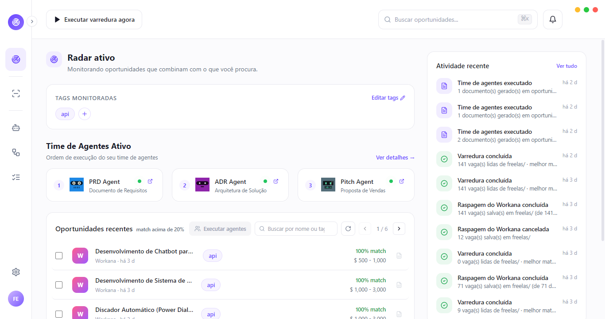
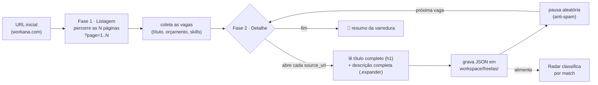
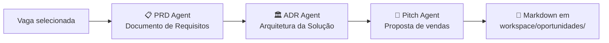
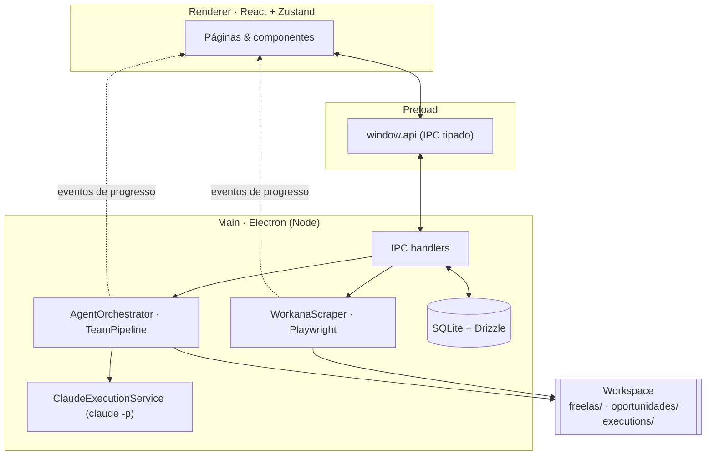

<a name="topo"></a>

<p align="center">
  
</p>

<h1 align="center">Freela Radar</h1>

<p align="center">
  <strong>Central operacional de agentes de IA que transforma oportunidades freelancer em propostas vencedoras.</strong>
</p>

<p align="center">
  Raspa vagas, classifica por match e gera <strong>PRD → Arquitetura → Pitch</strong> — <em>100% local</em>, no seu computador.
</p>

<p align="center">
  
  
  
  
  
  
  
  
  
  
  
</p>

<p align="center">
  
  
  
  
  
</p>

<p align="center">
  <a href="#-começando"></a>
  &nbsp;
  <a href="#-funcionalidades"></a>
</p>

<p align="center">
  <a href="#-visão-geral">Visão geral</a> ·
  <a href="#-destaques">Destaques</a> ·
  <a href="#-funcionalidades">Funcionalidades</a> ·
  <a href="#-scrapper-do-workana">Scrapper</a> ·
  <a href="#-pipeline-de-agentes">Pipeline</a> ·
  <a href="#-stack">Stack</a> ·
  <a href="#-começando">Começando</a> ·
  <a href="#-arquitetura">Arquitetura</a> ·
  <a href="#-configuração">Configuração</a> ·
  <a href="#-contribuindo">Contribuindo</a> ·
  <a href="#-licença">Licença</a>
</p>

<br/>

<p align="center">
  
</p>

---

## 🧭 Visão geral

**Freela Radar** é um app de **desktop** que reúne, em um só lugar, todo o fluxo de quem vive de freelancing técnico:

```text
raspar vagas  →  classificar por match  →  gerar proposta com IA  →  enviar
```

Você aponta o **Scrapper** para uma listagem do Workana, ele abre cada vaga, lê a descrição completa e grava tudo como JSON local. O **Radar** classifica essas vagas pelo **% de match** com as suas tags. E o **pipeline de agentes** (rodando via Claude Code) transforma a vaga escolhida em **PRD → Arquitetura → Pitch** pronto para o cliente.

> [!NOTE]
> **Sem backend, sem conta, sem nuvem.** Os dados ficam em **SQLite** e arquivos JSON/Markdown no seu computador — nada sai da sua máquina.

---

## ✨ Destaques

<table>
  <tr>
    <td width="33%" valign="top">
      <h3>🎯 Match inteligente</h3>
      Cada vaga é classificada por <strong>% de aderência</strong> às suas tags e pesos — o que importa aparece primeiro.
    </td>
    <td width="33%" valign="top">
      <h3>🕷️ Scraping de verdade</h3>
      O Playwright abre cada vaga e lê a <strong>descrição completa</strong>, não apenas o resumo da listagem.
    </td>
    <td width="33%" valign="top">
      <h3>🤖 Propostas com IA</h3>
      Um pipeline de agentes transforma a vaga em <strong>PRD → Arquitetura → Pitch</strong> via Claude Code.
    </td>
  </tr>
  <tr>
    <td width="33%" valign="top">
      <h3>🔒 100% local</h3>
      SQLite + arquivos no seu computador. <strong>Sem backend, sem nuvem, sem conta.</strong>
    </td>
    <td width="33%" valign="top">
      <h3>🧩 Studio de agentes</h3>
      Edite <strong>prompts, modelo, temperatura e tools</strong> de cada agente visualmente.
    </td>
    <td width="33%" valign="top">
      <h3>🎛️ Tudo configurável</h3>
      Match engine, scraping e execução ajustáveis direto pela <strong>interface</strong>.
    </td>
  </tr>
</table>

---

## 🚀 Funcionalidades

| Módulo | O que faz |
|---|---|
| 🛰️ **Radar** | Dashboard de oportunidades lidas de `freelas/`, classificadas por % de match, com KPIs do dia e atividade recente |
| 🕷️ **Scrapper** | Raspagem real do **Workana** com Playwright — múltiplas páginas, descrição completa e log ao vivo em tempo real |
| 🌐 **Sites** | Cadastro e gestão das fontes monitoradas (status, intervalo de scan, contagem de vagas) |
| 🤖 **Studio** | Editor visual de agentes: prompts (soul/system/operational), modelo, temperatura, tools e avatar |
| 🔗 **Pipeline** | Execução em cadeia (handoff) dos agentes sobre as vagas selecionadas, com progresso em tempo real |
| ✅ **Tasks** | Acompanhamento das execuções e artefatos gerados |
| ⚙️ **Settings** | Geral · Claude · **Playwright** · Chaves · Match Engine — tudo persistido no SQLite |

<details>
<summary><strong>🔍 Outros detalhes que fazem diferença</strong></summary>

<br/>

- **Match engine configurável** — palavra inteira vs. substring, case sensitivity, escopo (título+descrição ou só descrição) e limiar mínimo de exibição.
- **Notificações em tempo real** — sininho com as últimas atividades (varreduras, execuções, erros).
- **Workspace organizado** — saídas em `freelas/`, `oportunidades/` e `executions/`, com nomes estruturados.
- **Temas** — claro e `dio.me`.
- **Atalhos** — <kbd>Ctrl</kbd> + <kbd>S</kbd> salva o agente em edição.
- **100% offline** — SQLite local + arquivos; nada sai da sua máquina.

</details>

---

## 🕷️ Scrapper do Workana

O Scrapper abre um **Chromium real** (Playwright, headless) e roda em **duas fases**:



**Recursos**

- 📄 **Descrição completa** — não para no resumo da listagem: abre a `source_url` de cada vaga e lê o corpo inteiro do projeto.
- 🏷️ **Título completo** — usa o `<h1>` do detalhe (e o atributo `title` da listagem), nunca o texto truncado com `…`.
- 💤 **Pausa aleatória anti-spam** — a cada vaga espera um tempo **sorteado** dentro de uma faixa mín–máx configurável.
- 📟 **Log ao vivo estilo antivírus** — uma linha por ação, com emoji por tipo e **mais recentes no topo**.
- 💾 **Saída idempotente** — cada vaga vira `{id}_{slug}.json` em `freelas/` no formato `Opportunity`; o `id` deriva da URL, então re-raspar **sobrescreve** em vez de duplicar.
- 📌 **Memória da URL** — a última URL usada fica salva no banco e volta sozinha na próxima vez.
- 🎛️ **Tudo configurável** em `Settings → Playwright` (headless, canal do navegador, user-agent, viewport, timeouts, bloqueio de recursos, pausas e system prompt).

> [!TIP]
> As vagas raspadas aparecem no **Radar** assim que você roda uma varredura — que recalcula o match com as suas tags.

> [!WARNING]
> Use o scraping com responsabilidade: respeite os termos de uso do Workana e mantenha as **pausas anti-spam** ativas para não sobrecarregar o site.

---

## 🔗 Pipeline de agentes

Cada agente é executado pelo **Claude Code CLI** (`claude -p`), com modelo, flags e prompts configuráveis no Studio. O pipeline padrão faz o handoff de uma vaga até uma proposta pronta:



| Agente | Papel | Saída |
|---|---|---|
| 📋 **PRD Agent** | Levanta os requisitos da vaga | Documento de requisitos |
| 🏛️ **ADR Agent** | Define a arquitetura da solução | Decisões de arquitetura |
| 💬 **Pitch Agent** | Escreve a proposta de vendas | Pitch pronto para o cliente |

No **Studio** você edita os três blocos de prompt (soul / system / operational), modelo, temperatura, tools e o avatar de cada agente; arrasta para reordenar; e dispara em lote sobre várias vagas de uma vez.

---

## 🧱 Stack

| Camada | Tecnologia |
|---|---|
| Desktop | **[Electron 33](https://www.electronjs.org/)** (processo main + preload + renderer) |
| Frontend | **[React 18](https://react.dev/)** + **[TypeScript 5](https://www.typescriptlang.org/)** |
| Estilo | **[Tailwind CSS 3](https://tailwindcss.com/)** + CSS variables (temas) |
| Estado | **[Zustand 5](https://github.com/pmndrs/zustand)** |
| Banco | **[SQLite](https://www.sqlite.org/)** ([`better-sqlite3`](https://github.com/WiseLibs/better-sqlite3)) + **[Drizzle ORM](https://orm.drizzle.team/)** |
| Raspagem | **[Playwright](https://playwright.dev/)** (Chromium headless) |
| IA | **[Claude Code CLI](https://www.anthropic.com/claude-code)** (`claude -p`) |
| Animações | **[Framer Motion](https://www.framer.com/motion/)** + CSS keyframes |
| Avatares | **[DiceBear](https://www.dicebear.com/)** (bottts) |
| Ícones | **[Lucide React](https://lucide.dev/)** |
| Build | **[electron-vite](https://electron-vite.org/)** + **[electron-builder](https://www.electron.build/)** |

---

## ⚡ Começando

> [!IMPORTANT]
> **Pré-requisitos**
> - **[Node.js](https://nodejs.org/) 18+**
> - **[Claude Code CLI](https://www.anthropic.com/claude-code)** instalado e autenticado — necessário para o pipeline de agentes (verifique com `claude --version`)
> - **Chromium do Playwright** — para o Scrapper (instalado no passo 4 abaixo)

### Instalação

```bash
# 1. Clone o repositório
git clone https://github.com/seu-usuario/freela-radar.git
cd freela-radar

# 2. Instale as dependências
npm install

# 3. Recompile os módulos nativos para o Electron (better-sqlite3)
npm run rebuild

# 4. Baixe o navegador do Playwright (usado pelo Scrapper)
npx playwright install chromium

# 5. Rode em desenvolvimento
npm run dev
```

> [!NOTE]
> No primeiro start, o app pede para configurar **seu nome**, o **caminho do banco** e a **pasta de workspace**.

---

## 📖 Uso

1. **Raspe** — abra **Scrapper**, informe a URL do Workana e quantas páginas percorrer, e clique em **Iniciar raspagem**. Acompanhe o log ao vivo.
2. **Classifique** — vá ao **Radar** e clique em **Executar varredura agora**; as vagas são lidas de `freelas/` e ordenadas por match com as suas tags.
3. **Gere a proposta** — selecione uma ou mais vagas e rode o **pipeline de agentes**. Os documentos saem em `workspace/oportunidades/`.

> [!TIP]
> As tags monitoradas e seus pesos ficam em **Radar → Editar tags**; o comportamento do match em **Settings → Match Engine**.

---

## 🏗️ Arquitetura

Electron com três camadas isoladas; o renderer só fala com o main por **IPC tipado** (preload):



- **Fonte de verdade das vagas:** os JSON em `{workspace}/freelas/`. O Scrapper escreve; o Radar lê e classifica em memória.
- **Streaming de progresso:** `EventEmitter` no main → broadcast IPC → `onEvent` no preload → store/página (mesmo padrão para Scrapper, agentes e pipeline).

---

## ⚙️ Configuração

Tudo em **Settings**, persistido na tabela `settings` do SQLite:

| Aba | Conteúdo |
|---|---|
| **Geral** | Nome, caminho do banco, pasta de workspace, nomes das subpastas, tema e idioma |
| **Claude** | Caminho do CLI, flags, concorrência/fila do orquestrador e defaults de novos agentes |
| **Playwright** | Headless, canal do navegador, user-agent, locale, viewport, timeouts, bloqueio de recursos, pausas anti-spam, máx. de páginas e **system prompt** |
| **Chaves** | Chaves de API (Anthropic, OpenAI, Gemini) — armazenadas localmente |
| **Match Engine** | Limiar de exibição, escopo do texto, palavra inteira vs. substring e case sensitivity |

---

## 🗂️ Estrutura do projeto

```text
freela-radar/
├── electron/                 # Processo main (Node)
│   ├── db/                   # schema, migrate, seed (Drizzle + SQLite)
│   ├── ipc/                  # channels.ts + handlers.ts
│   ├── providers/            # provedores de plataformas (Workana, etc.)
│   ├── scanner/              # WorkanaScraper (Playwright), ScanScheduler
│   └── services/             # Orchestrator, AgentRunner, ClaudeExecution, TeamPipeline, ExecutionStorage, MatchEngine
├── src/                      # Processo renderer (React)
│   ├── components/           # Sidebar, TopBar, modais e componentes de UI
│   ├── pages/                # RadarPage, ScrapperPage, SitesPage, AgentsPage, PipelinePage, TasksPage, SettingsPage
│   ├── store/                # Zustand (useRadarStore)
│   ├── ipc/                  # api.ts (tipos do bridge)
│   └── index.css             # tema + keyframes de animação
├── assets/                   # icon.png / icon.ico
├── scripts/                  # utilitários (gen-icon, etc.)
└── preview.png               # screenshot do dashboard
```

<details>
<summary><strong>🗄️ Modelo de dados (SQLite)</strong></summary>

<br/>

`agents` · `agent_tools` · `monitored_sites` · `radar_tags` · `opportunities` ·
`agent_runs` · `agent_artifacts` · `settings` · `activity_logs`

</details>

---

## 📜 Scripts

| Comando | Descrição |
|---|---|
| `npm run dev` | Inicia o app em desenvolvimento (electron-vite) |
| `npm run build` | Build de produção (main + preload + renderer) |
| `npm run preview` | Roda o build de produção |
| `npm run typecheck` | Checagem de tipos TypeScript (main + web) |
| `npm run rebuild` | Recompila módulos nativos para o Electron |
| `npm run db:generate` | Gera migrations do Drizzle |
| `npm run gen:icon` | Gera o ícone do app (`icon.png` + `icon.ico`) |

---

## 🗺️ Roadmap

- [ ] Novos provedores de raspagem (99Freelas, Freelancer.com, RemoteOK)
- [ ] Etapa de IA para normalizar/resumir as descrições raspadas (usando o system prompt do Playwright)
- [ ] Agendamento de raspagens recorrentes
- [ ] Exportação das propostas em PDF

---

## 🤝 Contribuindo

Contribuições são muito bem-vindas! Este projeto é **aberto** justamente para que outras pessoas possam fazer fork, adaptar e melhorar.

1. Faça um **fork** do repositório
2. Crie um branch para a sua feature — `git checkout -b feat/minha-feature`
3. Commit das suas mudanças — `git commit -m "feat: adiciona minha feature"`
4. Push para o branch — `git push origin feat/minha-feature`
5. Abra um **Pull Request** descrevendo o que mudou

> [!TIP]
> Tem uma ideia, um bug ou uma sugestão? Abra uma **issue** — toda contribuição ajuda.

---

## 📄 Licença

Distribuído sob a licença **MIT** — veja [`LICENSE.md`](LICENSE.md) para o texto completo.

Sinta-se à vontade para fazer **fork**, adaptar e melhorar o projeto. 🙌

---

## 🎮 Autor

<table>
  <tr>
    <td align="center" valign="top" width="34%">
      
      <br/><br/>
      <b>★ FELIPE SILVA AGUIAR ★</b>
      <br/>
      <sub>AUTOR &amp; CRIADOR</sub>
    </td>
    <td valign="top">
<pre>
┌───────────────[ STATUS ]───────────────
│ NOME    Felipe Silva Aguiar
│ TÍTULO  "Digital Craftsman" · São Paulo, BR
│ CLASSE  Full-Stack Developer        LV 99
├─────────────────────────────────────────
│ HP    ████████████████████  ∞
│ MP    ███████████████░░░░░  café
│ EXP   ██████████████████░░  ~10 anos dev
├──────────────[ ATRIBUTOS ]──────────────
│ ATK   Node.js · .NET / C#
│ MAG   React · Angular
│ DEF   TypeScript · JavaScript
│ SPD   Tailwind · AWS · PostgreSQL
├───────────────[ REGISTRO ]──────────────
│ SEGUIDORES     5.8k
│ REPOSITÓRIOS   73
│ GUILDA         @digitalinnovationone (DIO)
│ LIMIT BREAK    Tornar-se Software Architect
└─────────────────────────────────────────
</pre>
<pre>
╭─────────────[ COMANDOS ]────────────────
│ ▶ <a href="https://github.com/felipeAguiarCode">GitHub</a>
│   <a href="https://www.linkedin.com/in/felipeaguiar-exe">LinkedIn</a>
│   <a href="https://youtube.com/@devaguia">YouTube</a>
│   <a href="https://instagram.com/felipeaguiar.exe">Instagram</a>
│   <a href="https://www.dio.me">DIO · Digital Innovation One</a>
╰─────────────────────────────────────────
</pre>
    </td>
  </tr>
</table>

<p align="center">
  <sub>Feito por <b>Felipe Silva Aguiar</b> para quem cansou de copiar e colar proposta. 🛰️</sub><br/>
  <sub>Curtiu? Deixe uma ⭐ no repositório · <a href="#topo">voltar ao topo ↑</a></sub>
</p>
