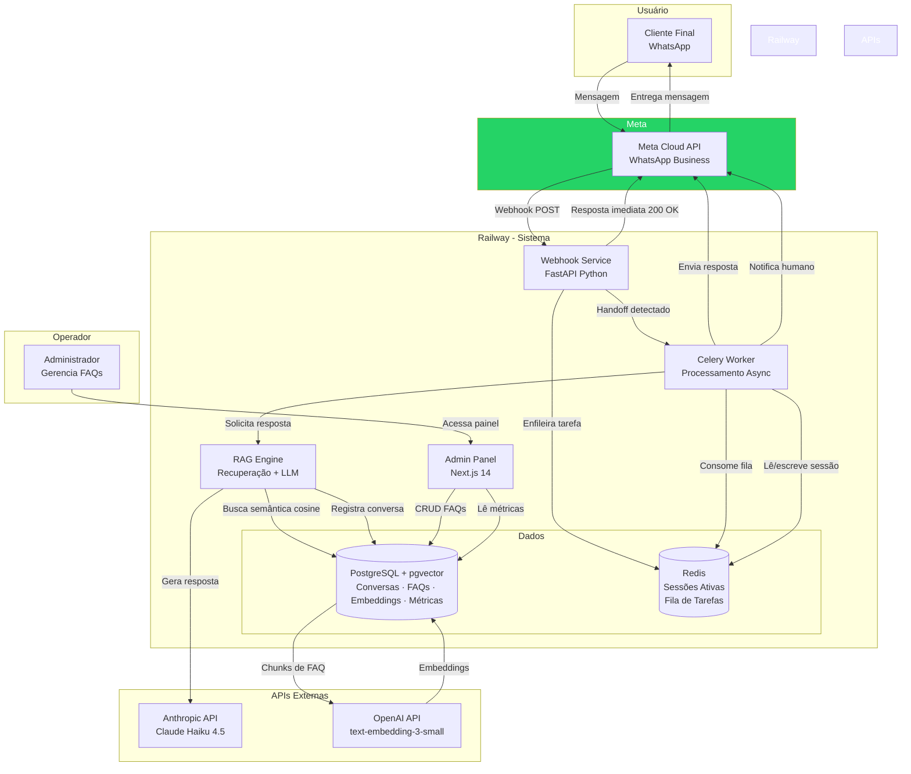

# Desenvolvimento de Sistema de Respostas Automáticas com Ia para Whatsapp

Busco um freelancer experiente para desenvolver um sistema de respostas automáticas para o WhatsApp, utilizando inteligência artificial. O objetivo é otimizar a comunicação e o atendimento ao cliente, permitindo que o sistema compreenda as perguntas dos usuários e forneça respostas relevantes e contextuais de forma autônoma. O projeto envolve a integração com a API do WhatsApp Business, a criação de modelos de IA para processamento de linguagem natural e a capacidade de aprender e melhorar com o tempo. O sistema deve ser capaz de lidar com perguntas frequentes, direcionar usuários para informações específicas e, idealmente, escalar para um grande volume de interações. É Fundamental que o profissional tenha conhecimento em desenvolvimento de chatbots e integração de APIs.

---

- **Pipeline:** PRD Agent → ADR Agent → Pitch Agent
- **Orçamento:** 1000 – 3000 USD
- **Tags:** api
- **Origem:** https://www.workana.com/job/desenvolvimento-de-sistema-de-respostas-automaticas-com-ia-para-whatsapp-155
- **Gerado em:** 15/06/2026, 20:37:04

---

## PRD Agent

# PRD — Sistema de Respostas Automáticas com IA para WhatsApp

---

## Intenção do Cliente (em uma frase)

> Automatizar o atendimento via WhatsApp com IA para reduzir carga operacional humana e responder clientes em escala sem perda de qualidade percebida.

---

## Hipóteses sobre o contexto real

1. **Volume crescente sem equipe proporcional** — o cliente provavelmente tem mais mensagens chegando do que consegue responder a tempo, gerando insatisfação ou perda de lead/venda.
2. **Atendimento fora do horário comercial** — a dor pode ser noturna/fim de semana, onde nenhum humano está disponível mas o cliente espera resposta imediata.
3. **FAQ repetitivo consumindo tempo** — a maior parte das perguntas é previsível (preço, prazo, disponibilidade, endereço), e o time humano está travado respondendo o mesmo sem agregar valor.

---

## 1. Contexto

O WhatsApp é o principal canal de comunicação B2C no Brasil. Clientes esperam respostas em minutos; empresas sem automação perdem conversões e sofrem com atrito operacional. O cliente busca um sistema que interaja de forma autônoma, contextual e escalável, sem substituir completamente o humano — mas reduzindo drasticamente a necessidade de intervenção manual no primeiro nível de atendimento.

---

## 2. Problema

**Dor real:** O cliente não consegue atender o volume de mensagens no WhatsApp com qualidade e velocidade, resultando em leads frios, clientes insatisfeitos e equipe sobrecarregada com interações de baixo valor.

O pedido superficial é "chatbot com IA". O problema real é **capacidade de atendimento que não escala com a demanda**.

---

## 3. Solução Proposta

Sistema conversacional integrado ao WhatsApp Business API capaz de:

- Interpretar mensagens em linguagem natural (NLP)
- Responder perguntas frequentes de forma autônoma
- Conduzir fluxos estruturados (ex: cotação, agendamento, triagem)
- Escalar para humano quando necessário (handoff)
- Aprender/melhorar com base no histórico de interações

---

## 4. Escopo

### In Scope

- Integração com WhatsApp Business API (via provider oficial ou BSP)
- Motor de NLP para compreensão de intenção e entidade
- Base de conhecimento configurável (FAQs, produtos, políticas)
- Fluxos de conversa parametrizáveis pelo cliente
- Mecanismo de handoff para atendente humano
- Dashboard básico de métricas (volume, taxa de resolução automática, handoffs)
- Suporte a texto; suporte a mídia (imagem/áudio) como nice-to-have

### Out of Scope

- CRM próprio (integração com CRM existente é possível, mas construir um não)
- App mobile ou painel de atendimento completo
- Treinamento de modelo de IA do zero (uso de modelos/APIs existentes)
- Suporte multi-idioma além do português (na v1)
- Integração com outros canais (Instagram, Telegram, etc.)

---

## 5. Requisitos Funcionais

| ID | Requisito |
|----|-----------|
| RF-01 | O sistema deve receber e processar mensagens de texto enviadas ao número WhatsApp Business cadastrado |
| RF-02 | O sistema deve identificar a intenção da mensagem e selecionar a resposta mais adequada da base de conhecimento |
| RF-03 | O sistema deve suportar fluxos conversacionais multi-turno (contexto mantido por sessão) |
| RF-04 | O sistema deve permitir cadastro e edição de FAQs e respostas via painel administrativo |
| RF-05 | O sistema deve detectar quando não consegue responder e acionar handoff para humano |
| RF-06 | O sistema deve registrar todas as conversas para análise posterior |
| RF-07 | O sistema deve enviar métricas básicas: volume diário, taxa de resolução automática, tempo médio de resposta |
| RF-08 | O sistema deve suportar envio de respostas com botões/listas (WhatsApp Interactive Messages) |

---

## 6. Requisitos Não-Funcionais

| ID | Requisito | Meta |
|----|-----------|------|
| RNF-01 | Tempo de resposta | < 3 segundos para 95% das mensagens |
| RNF-02 | Disponibilidade | 99,5% uptime mensal |
| RNF-03 | Escalabilidade | Suportar picos de até 1.000 mensagens simultâneas |
| RNF-04 | Segurança | Dados de conversa criptografados em trânsito e em repouso; conformidade com LGPD |
| RNF-05 | Manutenibilidade | Base de conhecimento atualizável pelo cliente sem deploy técnico |
| RNF-06 | Observabilidade | Logs de erro centralizados; alertas para falhas de integração com WhatsApp API |

---

## 7. Critérios de Aceite

1. **CA-01:** Sistema recebe mensagem no WhatsApp e responde em < 3 segundos em 95% dos casos em ambiente de produção com carga simulada de 100 mensagens/minuto.
2. **CA-02:** Taxa de resolução automática (sem handoff) ≥ 70% nas primeiras 2 semanas com base de conhecimento populada pelo cliente.
3. **CA-03:** Handoff para humano funciona em 100% dos casos onde o sistema não identifica intenção com confiança ≥ threshold configurado.
4. **CA-04:** Painel administrativo permite criar, editar e remover FAQs sem intervenção técnica, validado pelo próprio cliente em teste de aceitação.
5. **CA-05:** Dashboard exibe corretamente volume de mensagens, taxa de resolução e número de handoffs do dia anterior.
6. **CA-06:** Sistema sobrevive a 24h de operação contínua sem reinicialização manual ou degradação de performance (teste de estabilidade).
7. **CA-07:** Conversas armazenadas não expõem dados sensíveis em texto plano; validado por revisão de segurança do banco.

---

## 8. Riscos

| # | Risco | Probabilidade | Impacto | Mitigação |
|---|-------|---------------|---------|-----------|
| R-01 | Acesso à WhatsApp Business API pode ser burocrático/lento (aprovação Meta) | Alta | Alto | Iniciar processo de aprovação imediatamente; avaliar BSP intermediário como alternativa |
| R-02 | Base de conhecimento inicial insuficiente → IA com baixa taxa de resolução | Alta | Médio | Definir sessão de onboarding estruturado com cliente para popular FAQs antes do go-live |
| R-03 | Cliente espera IA "mágica" (aprende sozinha infinitamente) sem curadoria humana | Média | Alto | Alinhar expectativas no kickoff: aprendizado contínuo requer revisão humana periódica |
| R-04 | Volume real muito acima do esperado → custos de API de IA explodem | Média | Alto | Implementar rate limiting e alertas de custo; precificar com margem para variação |
| R-05 | Mudança de escopo durante execução (ex: "agora quero integrar com meu ERP") | Alta | Médio | Contrato com escopo fechado e processo de change request explícito |
| R-06 | Número WhatsApp do cliente já usado com app pessoal (não Business) | Baixa | Alto | Verificar elegibilidade do número na discovery antes de qualquer desenvolvimento |

---

## Handoff para ADR Agent

**O que o ADR Agent precisa decidir:**

- Provider de WhatsApp Business API (integração direta Meta vs. BSP como Twilio, WATI, 360dialog)
- Motor de NLP/IA (LLM via API vs. modelo fine-tuned vs. plataforma de chatbot)
- Estratégia de persistência de contexto conversacional (sessões stateful)
- Infraestrutura de hospedagem considerando requisito de 99,5% de uptime e picos de carga
- Abordagem para base de conhecimento (RAG, intent-based, hybrid)

**Restrição de orçamento a considerar:** USD 1.000–3.000 limita fortemente uso de plataformas pagas com licença alta. ADR deve priorizar soluções com custo variável (pay-per-use) sobre licenças fixas.

---

*PRD v1.0 — Pronto para consumo pelo ADR Agent e Pitch Agent.*

## ADR Agent

Vou produzir o ADR completo baseado no PRD fornecido.

---

# ADR-001 — Sistema de Respostas Automáticas com IA para WhatsApp

**Status:** Proposto  
**Data:** 2026-06-15  
**Autor:** ADR Agent  
**Consumidor:** Pitch Agent

---

## 1. Contexto

O cliente precisa de um sistema que atenda mensagens no WhatsApp de forma autônoma, com compreensão de linguagem natural, manutenção de contexto conversacional e handoff para humano quando necessário. O orçamento de USD 1.000–3.000 é a restrição mais crítica: elimina plataformas com licença mensal alta e exige arquitetura pay-per-use. A Meta impõe um processo de aprovação para a Business API que pode ser o maior risco de prazo do projeto.

---

## 2. Forças em Jogo

| Força | Direção |
|-------|---------|
| Orçamento apertado (USD 1k–3k) | Contra licenças fixas, a favor de pay-per-use |
| Prazo freelance típico (4–8 semanas) | Contra build de infraestrutura complexa |
| Volume alvo: picos de 1.000 msgs simultâneas | Exige stateless e assincronismo |
| FAQ mutável pelo cliente sem deploy | Exige base de conhecimento desacoplada do código |
| 99,5% uptime | Contra single-point-of-failure, a favor de managed services |
| Resposta < 3s (p95) | Contra chamadas síncronas encadeadas lentas |
| LGPD | Dados em trânsito e repouso criptografados |

---

## 3. Opções Consideradas

### 3.1 — Provider da WhatsApp Business API

**Opção A: Meta Cloud API (direto)**
- Gratuito para hospedar; custo por conversa (USD 0,0–0,08/conversa dependendo da categoria e país)
- 1.000 conversas iniciadas por usuário/mês gratuitas
- Requer aprovação do Meta Business Manager (processo de 3–15 dias)

**Opção B: BSP intermediário (WATI / 360dialog / Twilio)**
- WATI: ~USD 49–299/mês fixo + consumo → viola orçamento se licença recorrente
- 360dialog: ~€5–10/mês + custo por mensagem; menor atrito de aprovação pois o BSP já é aprovado
- Twilio: pay-per-use mas USD 0,005/mensagem, sem licença — caro em escala

**Opção C: Biblioteca não-oficial (Baileys/WPPConnect)**
- Zero custo de API
- Alto risco de ban do número do cliente pela Meta
- Viola ToS: inaceitável para produto entregue a cliente real

**Decisão 3.1:** Meta Cloud API (direto), com 360dialog como fallback se a aprovação atrasar mais de 2 semanas.

---

### 3.2 — Motor de NLP / IA

**Opção A: Plataforma de chatbot (Dialogflow CX / IBM Watson / Botpress Cloud)**
- Interface visual de fluxos, rápido para montar
- Dialogflow CX: USD 0,007/request → caro em escala; Watson: licença alta
- Botpress Cloud: free tier limitado, plano pago USD 495/mês → fora do orçamento
- Lock-in em plataforma proprietária

**Opção B: Rasa Open Source (self-hosted, intent-based)**
- Gratuito, mas requer treinamento de modelo NLU por intent
- Cada nova intenção = novo ciclo de treino; não escala bem para FAQ dinâmico
- Operacionalmente complexo para freelancer entregar e o cliente manter

**Opção C: LLM via API + RAG (Retrieval-Augmented Generation)**
- Claude Haiku 4.5: USD 0,25/1M tokens input, USD 1,25/1M output — extremamente barato
- GPT-4o-mini: USD 0,15/1M input, USD 0,60/1M output — alternativa
- RAG: base de conhecimento em texto puro → embeddings → busca semântica → LLM gera resposta
- Cliente atualiza FAQ sem deploy técnico; LLM adapta a resposta automaticamente
- Contexto multi-turno nativo via histórico da conversa

**Decisão 3.2:** LLM via API (Claude Haiku 4.5 como primário, GPT-4o-mini como fallback) com RAG sobre pgvector.

---

### 3.3 — Persistência de Contexto Conversacional

**Opção A: Stateful em memória do servidor**
- Simples de implementar; zero infraestrutura adicional
- Perde todo o contexto em restart; incompatível com múltiplas instâncias

**Opção B: Redis (TTL-based session store)**
- Latência < 1ms para leitura de sessão
- TTL configurable (ex: 24h de inatividade encerra sessão)
- Managed Redis disponível em Railway/Render por ~USD 15–25/mês

**Opção C: PostgreSQL como session store**
- Já existe na stack; sem infraestrutura adicional
- Mais lento que Redis para leitura frequente de sessão; requer índice cuidadoso

**Decisão 3.3:** Redis para estado de sessão ativa + PostgreSQL para histórico permanente de conversas.

---

### 3.4 — Infraestrutura de Hospedagem

**Opção A: AWS/GCP/Azure (gerenciado full)**
- Alta confiabilidade, escala automática
- Custo de setup e operação mensal > USD 100 — alto para o perfil do projeto
- Overkill para o volume atual

**Opção B: PaaS simples (Railway / Render)**
- Deploy via Docker Compose; zero configuração de servidor
- Railway: ~USD 20–50/mês para a stack completa (API + Redis + PostgreSQL)
- 99,5% uptime atingível com health checks e restart automático
- Escala vertical simples quando necessário

**Opção C: VPS + Docker Compose (DigitalOcean / Vultr)**
- DigitalOcean Droplet 2vCPU/4GB: USD 24/mês
- Controle total, mas requer gerenciamento de servidor, SSL, backups
- Menor custo mensal, maior custo operacional (tempo do dev)

**Decisão 3.4:** Railway (PaaS) para deploy inicial — menor overhead operacional encaixa no escopo de freelancer. Migração para VPS é trivial se o cliente quiser reduzir custo mensal após entrega.

---

### 3.5 — Abordagem para Base de Conhecimento

**Opção A: Intent-based puro**
- Cada FAQ vira um intent com exemplos de treino
- Requer retraining a cada mudança; não funciona bem com perguntas abertas

**Opção B: RAG com vector store externo (Pinecone / Weaviate Cloud)**
- Alta performance, mas custo de serviço adicional
- Pinecone free tier muito limitado; plano pago USD 70+/mês

**Opção C: RAG com pgvector (extensão do PostgreSQL existente)**
- Zero infraestrutura adicional
- Performance suficiente para o volume esperado (< 10k documentos, < 1.000 msgs/minuto)
- Admin faz upload de FAQ em texto → sistema chunka e embeda automaticamente
- Busca semântica via `cosine similarity` no pgvector

**Decisão 3.5:** RAG com pgvector — mesmo banco, zero custo incremental, performance adequada ao escopo.

---

## 4. Decisão Final — Stack Consolidado

| Camada | Tecnologia | Justificativa |
|--------|-----------|---------------|
| **Backend / Webhook** | Python 3.12 + FastAPI | Ecossistema de IA nativo; async nativo; rápido de desenvolver |
| **WhatsApp API** | Meta Cloud API | Gratuito; pay-per-use; BSP fallback: 360dialog |
| **LLM** | Claude Haiku 4.5 (Anthropic) | USD ~0,25/1M tokens; custo controlável; qualidade alta em português |
| **Embeddings** | text-embedding-3-small (OpenAI) | USD 0,02/1M tokens; pgvector compatível |
| **Base de conhecimento** | RAG + pgvector | Sem infra extra; atualização sem deploy |
| **Session store** | Redis (Railway managed) | < 1ms latência; TTL automático |
| **Banco de dados** | PostgreSQL 16 + pgvector | Histórico, FAQs, métricas, embeddings |
| **Admin Panel** | Next.js 14 (App Router) | Full-stack em um repo; deploy no mesmo Railway |
| **Fila assíncrona** | Celery + Redis | Processamento de webhooks fora do request cycle |
| **Hospedagem** | Railway | USD ~40–60/mês; managed; deploy por Git push |
| **Observabilidade** | Sentry (free tier) + logs estruturados | Alertas de erro sem custo adicional |

---

## 5. Justificativa

**Por que não plataforma de chatbot pronta (Botpress, WATI)?**  
O orçamento de USD 1k–3k é de desenvolvimento único. Plataformas com licença mensal de USD 49–499 consomem o budget recorrente do cliente após a entrega, criando lock-in e custo que não foi parte do escopo negociado. A solução custom com pay-per-uso da IA é 10–20x mais barata em operação para o volume descrito.

**Por que RAG e não fine-tuning?**  
Fine-tuning de LLM requer dataset curado, ciclo de treino, e re-treino a cada mudança de FAQ. RAG atualiza em tempo real: o cliente cola o FAQ no painel, o sistema embeda e já responde. Para FAQ de atendimento B2C, RAG supera fine-tuning em flexibilidade sem perda de qualidade relevante.

**Por que Claude Haiku 4.5?**  
Melhor relação custo/qualidade em português para respostas curtas de atendimento. A 500 tokens por conversa (médio), USD 0,25/1M tokens = USD 0,000125/conversa. Com 10.000 conversas/mês: USD 1,25. O budget de infra mensal (~USD 60) domina o custo de IA.

**Por que Railway e não VPS?**  
O cliente vai receber um sistema funcionando; não um servidor para gerenciar. Railway elimina setup de SSL, Docker network, backups automáticos. O custo extra de ~USD 10–20/mês vs VPS compra tempo de desenvolvimento e reduz risco de entrega.

---

## 6. Consequências

### Positivas
- **Custo operacional previsível:** USD 60–80/mês de infra + custo variável de IA proporcional ao uso real
- **Sem lock-in:** Stack open-source com APIs padrão; migração de provider é possível
- **Atualização de FAQ sem fricção:** Cliente opera de forma independente após entrega
- **Resposta < 3s atingível:** Webhook async + Redis session + LLM Haiku (latência típica 800ms–1,5s)
- **Escalabilidade razoável:** Railway escala verticalmente; para > 5.000 msgs/min, migraria para VPS com múltiplas instâncias Celery
- **Time-to-market rápido:** Stack familiar, sem treinamento de modelo, sem aprovações de plataforma além da Meta API

### Negativas
- **Dependência de APIs externas:** Meta + Anthropic são pontos de falha externos; mitigado com retry e fallback de resposta genérica
- **Custo de IA variável:** Pico inesperado de volume pode gerar custo de LLM acima do esperado; mitigado com rate limiting e alertas de custo
- **Aprovação Meta não é imediata:** Processo pode levar 3–15 dias; risco R-01 do PRD se materializa aqui; plano B: 360dialog como BSP
- **pgvector não substitui Pinecone em escala:** Acima de 1M documentos ou 100k msgs/dia, a performance de busca vetorial pode degradar — não é o caso v1
- **Admin Panel é MVP:** Next.js funcional mas não é produto de SaaS; para crescer além do cliente atual, precisaria de refatoração de multi-tenancy

---

## 7. Diagrama de Arquitetura

---

## Handoff para Pitch Agent

**Decisões consolidadas para estimativa:**

| Item | Decisão | Custo estimado |
|------|---------|---------------|
| WhatsApp API | Meta Cloud API (direto) | USD 0–80/mês (por conversa) |
| LLM | Claude Haiku 4.5 | USD 1–10/mês no volume inicial |
| Embeddings | OpenAI text-embedding-3-small | USD < 1/mês |
| Infraestrutura | Railway (API + Redis + PostgreSQL) | USD 40–60/mês |
| Admin Panel | Next.js (mesmo deploy Railway) | Incluso na infra |
| **Total operacional mensal** | | **USD 50–150/mês** |

**Componentes a estimar em prazo (para Pitch Agent):**
1. Setup Meta Cloud API + webhook receiver (1–2 dias)
2. RAG engine + embeddings + pgvector (3–4 dias)
3. Motor conversacional multi-turno + handoff (3–4 dias)
4. Admin Panel CRUD de FAQs (3–4 dias)
5. Dashboard de métricas (2–3 dias)
6. Testes, ajustes e deploy Railway (2–3 dias)

**Prazo realista total:** 3–4 semanas para MVP com todos os critérios de aceite do PRD.  
**Risco principal a comunicar:** Aprovação da Meta API pode bloquear os primeiros testes end-to-end; recomendar iniciar o processo de aprovação antes de qualquer código.

---

*ADR v1.0 — Pronto para consumo pelo Pitch Agent.*

## Pitch Agent

---

# Proposta: Sistema de Atendimento Automático via WhatsApp com IA

**Para:** [Nome do Cliente]
**Data:** 15 de junho de 2026
**Válida por:** 7 dias

---

## 1. O problema que você está enfrentando

Hoje, cada mensagem que chega no seu WhatsApp depende de uma pessoa disponível para responder — e isso cria gargalos reais: clientes esperando, perguntas repetitivas consumindo tempo da equipe, e oportunidades perdidas fora do horário comercial.

Você quer um sistema que compreenda o que o cliente pergunta, responda com contexto, aprenda com o seu negócio e escale sem contratar mais gente. A questão não é *se* automatizar — é fazer isso sem pagar caro em licença de plataforma todo mês, e sem virar refém de uma ferramenta que não é sua.

---

## 2. O que entrego

> **Um sistema de atendimento autônomo no WhatsApp que compreende linguagem natural, responde com base no seu conteúdo e aprende conforme você atualiza — sem depender de plataformas de chatbot caras.**

---

## 3. Entregáveis

- **Webhook integrado à API Oficial do WhatsApp Business (Meta)** — número aprovado, recebendo e enviando mensagens em produção
- **Motor de respostas com IA** — entende perguntas em português, mantém contexto ao longo da conversa, responde com base na sua base de conhecimento
- **Base de conhecimento editável** — você atualiza o FAQ pelo painel; o sistema já responde diferente na próxima mensagem, sem necessidade de programador
- **Painel administrativo web** — CRUD de FAQs, visualização de conversas ativas e métricas de atendimento (volume, tempo médio de resposta, tópicos mais perguntados)
- **Handoff para humano** — quando o sistema detecta que não consegue resolver, transfere a conversa para um atendente com histórico completo
- **Deploy em produção** com monitoramento de erros e restart automático em caso de falha

---

## 4. Como vamos trabalhar

Nada de plataforma de chatbot com mensalidade de USD 300. A solução é construída sobre sua própria infraestrutura, usando APIs pagas por uso — você paga proporcional ao que usa, não uma licença fixa.

| Camada | O que usamos | Por quê |
|---|---|---|
| WhatsApp | API Oficial da Meta | Gratuito para hospedar; aprovado e sem risco de ban |
| IA | Claude Haiku (Anthropic) | Melhor custo-benefício em português; ~USD 1–10/mês no volume inicial |
| Base de conhecimento | Busca semântica sobre seu FAQ | Atualização sem código; responde mesmo perguntas fora do script exato |
| Sessão conversacional | Cache de alta velocidade (Redis) | Mantém o contexto entre mensagens sem lentidão |
| Painel admin | Aplicação web moderna (Next.js) | Interface limpa para você operar sem depender de dev |
| Hospedagem | Railway (PaaS) | Deploy por push de código; SSL automático; backup incluso |

**Custo operacional estimado após a entrega: USD 50–150/mês** — infraestrutura + consumo de IA proporcional ao volume de mensagens.

---

## 5. Cronograma

| Semana | O que acontece |
|---|---|
| **Semana 1** | Setup da API do WhatsApp (aprovação Meta iniciada no dia 1) + webhook recebendo mensagens + estrutura do banco de dados |
| **Semana 2** | Motor de IA com RAG + base de conhecimento funcional + testes de conversa multi-turno |
| **Semana 3** | Painel administrativo + handoff para humano + integração completa end-to-end |
| **Semana 4** | Testes de carga + ajustes finos + deploy em produção + entrega com documentação de uso |

> **Prazo total: 4 semanas.** O único fator externo que pode impactar o prazo é a aprovação da conta no Meta Business Manager, que leva de 3 a 15 dias — por isso iniciamos esse processo no primeiro dia do projeto, em paralelo com o desenvolvimento.

---

## 6. Investimento

**USD 2.200 – 2.800** (pagamento único de desenvolvimento)

A faixa depende do volume de integrações extras e do nível de personalização do painel que precisarmos no escopo final. Defino o número exato depois de uma conversa de 30 minutos com você para entender os fluxos prioritários.

O que está incluído: tudo descrito nos entregáveis acima, deploy em produção, documentação de uso e 2 semanas de suporte pós-entrega para ajustes.

O que **não** está incluído: criação do conteúdo do FAQ (você fornece), custo mensal de infraestrutura (pago por você diretamente aos provedores).

---

## 7. Próximos passos

Se essa proposta faz sentido para o seu momento, me responda confirmando interesse — **envio o contrato e o cronograma detalhado em até 24 horas**.

Para acelerar, já pode ir separando:
- [ ] Acesso ao seu WhatsApp Business (número e conta Meta Business Manager)
- [ ] Rascunho das 10–15 perguntas mais frequentes que chegam hoje

Qualquer dúvida antes disso, pode perguntar aqui mesmo.

---

*Proposta preparada por [Seu Nome] · [seu@email.com] · [linkedin ou site]*
