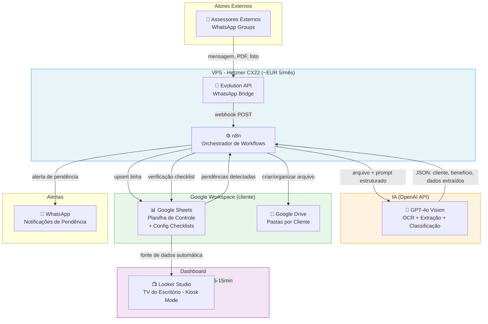

# Automação Completa e Inteligente para Escritório Previdenciário com Integração Whatsapp e Ia

Estamos buscando um especialista em automação para desenvolver uma solução integrada e robusta para otimizar o fluxo operacional de nosso escritório previdenciário. O objetivo principal é automatizar a gestão de documentos e informações de clientes que chegam via WhatsApp, integrando-os com Google Drive, Google Sheets e um Dashboard interativo, com forte uso de Inteligência Artificial.

Atualmente, o controle de contratos, documentos e informações de clientes enviados por assessores externos via grupos de WhatsApp é feito manualmente. Desejamos transformar este processo em um fluxo operacional totalmente automatizado.

Fluxo Operacional Desejado:
Quando um assessor enviar mensagens, PDFs, fotos ou outros documentos nos grupos de WhatsApp, o sistema deverá realizar as seguintes ações:
* Identificar automaticamente o cliente associado aos documentos ou informações.
* Identificar o tipo de benefício previdenciário (ex: BPC, aposentadoria, auxílio-doença, salário-maternidade, pensão).
* Extrair informações relevantes e estruturadas dos documentos enviados.
* Atualizar automaticamente as planilhas de controle existentes no Google Sheets.
* Criar uma nova pasta para o cliente no Google Drive, caso não exista, ou localizar a pasta existente.
* Organizar os arquivos recebidos dentro da pasta do cliente de forma padronizada.
* Verificar a conformidade dos documentos com um checklist de documentos obrigatórios.
* Identificar e sinalizar pendências documentais ou de informação.
* Gerar alertas e relatórios automáticos sobre o status dos casos.

Uso de Inteligência Artificial (IA):
A solução deverá incorporar IA para as seguintes funcionalidades:
* Leitura e interpretação de mensagens enviadas nos grupos de WhatsApp.
* Interpretação de informações contidas em documentos e mídias (PDFs, fotos).
* Classificação automática de casos e tipos de benefício.
* Detecção proativa de documentos faltantes ou inconsistências.
* Geração de resumos automáticos dos casos ou documentos.
* Produção de relatórios de produtividade dos assessores e da equipe.

Dashboard Interativo:
Será necessário desenvolver um painel de controle (dashboard) com as seguintes métricas e visualizações, adequado para exibição em TV no escritório:
* Contratos recebidos e processados por assessor.
* Lista de pendências por assessor.
* Casos aguardando documentos ou informações adicionais.
* Casos prontos para protocolo junto aos órgãos competentes.
* Produtividade geral da equipe.
* Alertas visuais para prazos importantes e pendências críticas.

Ferramentas e Tecnologias Desejadas:
* Plataformas de automação como Make (Integromat).
* Integração via WhatsApp API.
* Serviços de IA como OpenAI/ChatGPT.
* Ecossistema Google: Google Drive e Google Sheets.
* Ferramentas de Business Intelligence para o dashboard, como Looker Studio ou Power BI.

Buscamos profissionais com comprovada experiência em projetos de automação semelhantes, preferencialmente com vivência em automação documental, escritórios de advocacia ou processos administrativos. É Fundamental apresentar portfólio relevante e informar sobre prazos de entrega, valor do projeto e possibilidade de suporte pós-implantação.

---

- **Pipeline:** PRD Agent → ADR Agent → Pitch Agent
- **Orçamento:** 3000 – ? USD
- **Tags:** api
- **Origem:** https://www.workana.com/job/automacao-completa-e-inteligente-para-escritorio-previdenciario-com-integracao-whatsapp-e-ia
- **Gerado em:** 15/06/2026, 20:19:02

---

## PRD Agent

# PRD — Automação Operacional para Escritório Previdenciário

---

## Extração de Intenção

**Intenção do cliente em uma frase:**
Eliminar o trabalho manual de triagem, classificação e acompanhamento de documentos previdenciários recebidos via WhatsApp, transformando grupos de mensagens em um fluxo operacional rastreável e auditável.

---

## Hipóteses sobre o que está por trás do pedido

1. **Gargalo de triagem humana:** O escritório está perdendo SLA ou deixando casos pendentes sem perceber porque a classificação e o filing de documentos dependem de atenção humana constante — o custo real é em retrabalho e casos indeferidos por documentação incompleta.
2. **Problema de gestão de assessores externos:** O dashboard e os relatórios de produtividade indicam que há dificuldade em responsabilizar assessores por entregas — o cliente quer visibilidade gerencial para cobrar, não apenas organizar.
3. **Risco jurídico-documental:** Em processos previdenciários, documentos faltantes causam indeferimento e retrabalho caro. O checklist e os alertas proativos sugerem que já ocorreram perdas por falhas documentais.

---

## 1. Contexto

Escritório de advocacia previdenciária opera com assessores externos que submetem documentos de clientes via grupos de WhatsApp. O volume de casos e a diversidade de tipos de benefício (BPC, aposentadoria, auxílio-doença, salário-maternidade, pensão) tornam inviável o processamento manual contínuo. A operação atual cria silos de informação, risco de perda de documentos e ausência de rastreabilidade por caso.

---

## 2. Problema

**Dor primária:** Cada documento recebido no WhatsApp exige que alguém do escritório identifique o cliente, classifique o tipo de processo, mova o arquivo para o local correto e atualize a planilha de controle — um ciclo manual repetido dezenas de vezes por dia, propenso a erro e sem auditoria.

**Consequências concretas:**
- Documentos perdidos ou arquivados errado → risco de indeferimento de benefícios
- Sem visibilidade de pendências → prazos processuais descumpridos
- Impossibilidade de medir SLA por assessor → gestão de equipe externa às cegas
- Escalabilidade zero: crescimento de carteira = crescimento linear de carga operacional

---

## 3. Solução Proposta

Pipeline de automação integrado que:
1. Monitora grupos de WhatsApp em tempo real
2. Usa IA para extrair, classificar e estruturar informações de mensagens e documentos (PDF, imagem)
3. Persiste dados no Google Sheets e arquivos no Google Drive, de forma padronizada e automática
4. Verifica conformidade documental contra checklists por tipo de benefício
5. Expõe um dashboard operacional em tempo real para acompanhamento gerencial e exibição em TV no escritório

---

## 4. Escopo

### In Scope
- Monitoramento de grupos de WhatsApp especificados pelo cliente
- Extração de texto e dados de PDFs e imagens via IA
- Classificação automática de cliente e tipo de benefício
- Criação/organização de estrutura de pastas no Google Drive por cliente
- Atualização automática de planilhas de controle no Google Sheets
- Checklist de documentos obrigatórios por tipo de benefício, com sinalização de pendências
- Geração de alertas (mensagem/notificação) para pendências críticas
- Dashboard com métricas operacionais e de produtividade (adequado para TV)
- Relatórios de produtividade por assessor

### Out of Scope
- Peticionamento eletrônico junto ao INSS ou tribunais
- Atendimento direto ao cliente final (o sistema serve assessores e equipe interna)
- Integração com sistemas jurídicos externos (PJe, e-SAJ, etc.)
- Armazenamento de documentos fora do ecossistema Google
- Geração de peças processuais ou minutas jurídicas
- App mobile dedicado

---

## 5. Requisitos Funcionais

### RF-01 — Captura de Mensagens e Documentos
- O sistema deve monitorar N grupos de WhatsApp configurados pelo cliente
- Capturar texto, PDFs, imagens e outros arquivos enviados por assessores
- Registrar metadados: remetente, timestamp, grupo de origem, tipo de mídia

### RF-02 — Identificação de Cliente e Caso
- Identificar o cliente associado a cada mensagem/documento com base em nome, CPF, número de protocolo ou outros identificadores presentes no conteúdo
- Criar registro novo se cliente não existir; associar a registro existente se já constar na base

### RF-03 — Classificação de Tipo de Benefício
- Classificar automaticamente o tipo de benefício previdenciário (BPC, aposentadoria por idade, aposentadoria por tempo de contribuição, auxílio-doença, salário-maternidade, pensão por morte)
- Sinalizar para revisão humana quando a confiança da classificação estiver abaixo do limiar definido

### RF-04 — Extração Estruturada de Informações
- Extrair dados relevantes de documentos (nome, CPF, datas, valores, CID, vínculos empregatícios, etc.) de acordo com o tipo de benefício
- Estruturar os dados extraídos para alimentar diretamente o Google Sheets

### RF-05 — Gestão de Arquivos no Google Drive
- Criar pasta para cliente seguindo estrutura padronizada definida pelo cliente, caso não exista
- Organizar arquivos recebidos em subpastas por tipo de documento/benefício
- Renomear arquivos seguindo convenção de nomenclatura definida

### RF-06 — Atualização de Planilhas no Google Sheets
- Atualizar automaticamente as planilhas de controle existentes com os dados extraídos
- Criar nova linha para novo cliente; atualizar linha existente para cliente já cadastrado
- Registrar histórico de atualizações com timestamp e origem

### RF-07 — Verificação de Conformidade Documental
- Comparar documentos recebidos com checklist de documentos obrigatórios por tipo de benefício
- Identificar documentos faltantes ou com inconsistências
- Sinalizar pendências diretamente na planilha e/ou via alerta

### RF-08 — Alertas e Notificações
- Gerar alertas para: pendências documentais críticas, casos há X dias sem movimentação, casos prontos para protocolo
- Canal de alerta configurável (ex: mensagem no próprio WhatsApp, e-mail, ou painel)

### RF-09 — Dashboard Operacional
- Exibir em tempo real: contratos recebidos/processados por assessor, lista de pendências, casos aguardando documentos, casos prontos para protocolo, produtividade geral
- Alertas visuais para prazos e pendências críticas
- Adequado para exibição contínua em TV (modo kiosk, atualização automática)

### RF-10 — Relatórios de Produtividade
- Relatório periódico (diário/semanal) com volume de casos por assessor, tempo médio de processamento, taxa de pendências geradas vs. resolvidas

---

## 6. Requisitos Não-Funcionais

### RNF-01 — Latência de Processamento
- Documento recebido no WhatsApp deve ser processado e refletido no Google Sheets e Drive em no máximo **5 minutos** após o recebimento

### RNF-02 — Disponibilidade
- O pipeline de automação deve operar **24/7** com tolerância a falhas; mensagens recebidas fora do horário comercial devem ser processadas sem perda

### RNF-03 — Precisão da IA
- Taxa de acerto na identificação de cliente: ≥ 90%
- Taxa de acerto na classificação de tipo de benefício: ≥ 85%
- Dados não identificados com confiança suficiente devem ser sinalizados para revisão humana (nenhuma falha silenciosa)

### RNF-04 — Segurança e Privacidade
- Dados de clientes (CPF, histórico médico, informações previdenciárias) são sensíveis — LGPD aplicável
- Credenciais de acesso (WhatsApp API, Google, IA) não podem ser hardcoded; devem ser gerenciadas via variáveis de ambiente ou cofre de segredos
- Acesso ao Drive e Sheets restrito às contas autorizadas pelo cliente

### RNF-05 — Rastreabilidade
- Cada ação automatizada deve gerar log auditável: o que foi processado, quando, com qual resultado
- Deve ser possível reprocessar manualmente um documento em caso de falha

### RNF-06 — Manutenibilidade
- O checklist de documentos por tipo de benefício deve ser editável pelo cliente sem necessidade de intervenção técnica (ex: via planilha de configuração)
- Novos grupos de WhatsApp devem poder ser adicionados ao monitoramento via configuração, sem redeploy

### RNF-07 — Escalabilidade
- A solução deve suportar crescimento de carteira sem degradação proporcional de performance (arquitetura orientada a eventos, não polling pesado)

---

## 7. Critérios de Aceite

1. **CA-01:** Dado um documento PDF enviado por assessor em grupo monitorado, o sistema identifica o cliente correto (por nome ou CPF) e cria/atualiza sua pasta no Google Drive em até 5 minutos — verificável por log de processamento.

2. **CA-02:** O sistema classifica corretamente o tipo de benefício em pelo menos 85% dos casos em um conjunto de teste de 20 documentos reais fornecidos pelo cliente antes do go-live.

3. **CA-03:** Ao receber um conjunto de documentos incompleto para um tipo de benefício, o sistema sinaliza os documentos faltantes na planilha de controle e gera alerta — sem necessidade de intervenção humana.

4. **CA-04:** O dashboard exibe, em tempo real e sem atualização manual, os indicadores: contratos processados por assessor, pendências abertas e casos prontos para protocolo — testado com dados de um dia completo de operação.

5. **CA-05:** Um assessor externo envia uma foto de documento manuscrito com CPF e nome do cliente; o sistema extrai corretamente ao menos CPF e nome e os registra na planilha — verificável pelo cliente ao comparar input vs. output.

6. **CA-06:** Relatório de produtividade semanal é gerado automaticamente e entregue no canal definido sem ação manual, contendo volume de casos por assessor e taxa de pendências.

7. **CA-07:** O checklist de documentos obrigatórios pode ser editado diretamente em planilha de configuração e o sistema passa a usar a versão atualizada no próximo processamento, sem intervenção técnica.

8. **CA-08:** Nenhuma mensagem recebida nos grupos monitorados durante um período de 72h de teste é perdida ou deixada sem processamento — auditável por comparação entre log do WhatsApp e registros no Drive/Sheets.

---

## 8. Riscos

| # | Risco | Probabilidade | Impacto | Mitigação |
|---|-------|--------------|---------|-----------|
| R-01 | **Acesso à WhatsApp API:** Meta restringe uso da API oficial; soluções não-oficiais violam ToS e podem ser bloqueadas a qualquer momento | Alta | Crítico | Definir desde o início se será usada API oficial (Meta Cloud API / número dedicado) ou solução terceira; alinhar com cliente o risco de bloqueio |
| R-02 | **Qualidade dos documentos recebidos:** Fotos desfocadas, PDFs escaneados em baixa resolução ou manuscritos degradam a extração por IA | Alta | Alto | Definir limiar mínimo de qualidade; documentos abaixo do limiar devem ser rejeitados com feedback ao assessor |
| R-03 | **Identificação ambígua de cliente:** Assessores enviando documentos sem mencionar nome/CPF explicitamente (ex: só uma foto do RG) pode gerar associações erradas | Média | Alto | Implementar fila de revisão humana para casos de baixa confiança; nunca associar automaticamente quando confiança < limiar |
| R-04 | **LGPD e dados sensíveis:** Dados previdenciários incluem histórico médico e financeiro — vazamento gera responsabilidade legal para o escritório | Média | Crítico | Exigir clareza sobre onde dados são processados (ex: OpenAI envia dados para servidores externos); avaliar uso de modelos com garantia de não retenção de dados |
| R-05 | **Dependência de plataformas terceiras:** Make, Google Workspace, OpenAI — mudanças de preço, limites de rate ou descontinuação afetam a solução | Média | Médio | Documentar dependências críticas; desenhar com baixo acoplamento onde possível |
| R-06 | **Resistência dos assessores externos:** Se o fluxo exigir que assessores mudem o formato de envio (ex: sempre incluir CPF), pode haver fricção | Média | Médio | Minimizar mudança de comportamento; o sistema deve funcionar com o formato atual de envio, não o ideal |
| R-07 | **Escopo de checklists previdenciários:** Cada tipo de benefício tem requisitos documentais próprios, que variam por escritório e até por agência do INSS | Alta | Médio | Levantar todos os checklists com o cliente antes do desenvolvimento; tratar como configuração editável, não hardcoded |

---

## Handoff para ADR Agent

**O que precisa de decisão técnica prioritária:**
- Estratégia de integração com WhatsApp (API oficial Meta vs. soluções de terceiros como Twilio, Z-API, Evolution API) — impacto em custo, confiabilidade e ToS
- Componente de OCR/extração de documentos (serviço gerenciado vs. modelo local) — impacto em LGPD e custo por volume
- Plataforma de orquestração (Make/n8n/código custom) — impacto em manutenibilidade e custo recorrente
- Stack do dashboard (Looker Studio vs. Power BI vs. solução custom) — impacto em atualização em tempo real e modo kiosk para TV

**O que precisa de decisão do Pitch Agent:**
- Orçamento base de R$3.000 USD está na faixa baixa para o escopo descrito — Pitch Agent deve sinalizar o gap e propor estratégia de precificação em fases ou MVP

---

*PRD v1.0 — Pronto para consumo pelo ADR Agent e Pitch Agent.*

## ADR Agent

# ADR — Automação Operacional para Escritório Previdenciário

---

## 1. Contexto

Escritório de advocacia previdenciária opera com assessores externos submetendo documentos via grupos de WhatsApp. O volume de tipos de benefício (BPC, aposentadoria, auxílio-doença, salário-maternidade, pensão) e a natureza sensível dos dados (LGPD) tornam o processamento manual insustentável. O PRD está disponível e é a fonte de verdade deste ADR. O orçamento sinalizado (~USD 3.000) está abaixo do escopo completo — fator condicionante nas decisões de stack.

---

## 2. Forças em Jogo

| Força | Peso |
|---|---|
| **Custo total** (desenvolvimento + operação recorrente) | Crítico — orçamento apertado |
| **Mercado brasileiro** — soluções de WhatsApp usadas por 90% dos freelas BR | Alto |
| **LGPD** — dados previdenciários incluem histórico médico e CPF | Alto |
| **Manutenibilidade** — cliente final não é técnico, precisa editar checklists sozinho | Alto |
| **Latência** — SLA de 5 minutos do PRD (RNF-01) | Médio |
| **Escala** — carteira pode crescer, mas volume atual é de um escritório médio | Médio |
| **Time-to-market** — cliente quer solução funcionando, não MVP experimental | Alto |

---

## 3. Opções Consideradas

### Opção A — Make + Meta Cloud API + OpenAI + Looker Studio *(stack do cliente)*

**Como funciona:** Make orquestra tudo via no-code; Meta Cloud API é o canal oficial do WhatsApp; OpenAI faz a extração; Looker Studio entrega o dashboard.

**Prós:** Sem servidor para manter; Meta API é estável e conforme ToS; Make tem conectores nativos para Google Workspace.

**Contras:**
- Make cobra por operação — para um escritório com dezenas de documentos/dia, o custo mensal pode superar USD 100-200/mês facilmente.
- Meta Cloud API exige número de telefone dedicado, aprovação de WABA (WhatsApp Business Account) e aprovação de templates para mensagens ativas — processo burocrático de 2-4 semanas, potencial bloqueio de fluxo.
- Make tem limitações de lógica condicional complexa (loops, processamento de filas, reprocessamento manual) que esse pipeline vai exigir.
- Custo recorrente corrói a margem do freelancer no pós-venda.

**Descartada porque:** Custo operacional elevado + burocracia da Meta API incompatíveis com orçamento e prazo.

---

### Opção B — Código Custom (Python/FastAPI) + Evolution API + OpenAI + React Dashboard

**Como funciona:** Aplicação Python custom hospedada em VPS; Evolution API para WhatsApp; dashboard em React/Next.js com dados do Sheets.

**Prós:** Máximo controle; sem dependência de plataformas no-code; dashboard 100% customizável em tempo real.

**Contras:**
- Tempo de desenvolvimento 3-4x maior para o mesmo resultado funcional.
- Requer manutenção de infraestrutura (deploy, CI/CD, monitoramento).
- Dashboard custom em React para uma tela de TV num escritório previdenciário é overengineering severo.
- Com orçamento de USD 3k, não há espaço para esse nível de entrega.

**Descartada porque:** Overengineering para o escopo; inviável no orçamento dado.

---

### Opção C — n8n self-hosted + Evolution API + OpenAI GPT-4o + Looker Studio *(decisão)*

**Como funciona:** n8n orquestra o pipeline via workflow visual (low-code); Evolution API conecta ao WhatsApp sem burocracia de WABA; GPT-4o extrai e classifica; Google Sheets + Drive como persistence layer; Looker Studio como dashboard gratuito alimentado pelos Sheets.

**Prós:**
- n8n self-hosted: custo fixo ~USD 5-15/mês (VPS); zero custo por operação.
- Evolution API: adoção massiva no mercado BR, suporte ativo, integração nativa com n8n via webhook.
- GPT-4o: única chamada de IA resolve OCR + classificação + extração estruturada — sem precisar de serviço separado de OCR.
- Looker Studio: gratuito, nativo em Google Workspace, conecta direto ao Sheets.
- n8n é editável pelo freelancer sem redeploy; workflows são exportáveis/versionáveis em JSON.

**Contras:**
- Evolution API não é oficial Meta — ToS risk (documentado e aceito pelo cliente).
- n8n self-hosted exige VPS e manutenção básica de infra.
- Looker Studio tem refresh mínimo de 1-15 minutos (não é real-time puro) — aceitável para TV de escritório.

---

### Opção D (descartada brevemente) — Typebot + Zapier + Google Document AI

**Descartada** por custo (Zapier é o mais caro da categoria) e por não adicionar nada relevante sobre a Opção C para esse escopo.

---

## 4. Decisão

**Stack escolhido: n8n self-hosted + Evolution API + OpenAI GPT-4o + Google Sheets/Drive + Looker Studio**

| Camada | Tecnologia | Justificativa |
|---|---|---|
| WhatsApp | Evolution API (self-hosted, VPS) | Mercado BR, zero burocracia WABA, webhook nativo |
| Orquestração | n8n (self-hosted, mesmo VPS) | Custo fixo, low-code, exportável, sem lock-in de plataforma |
| IA / OCR | OpenAI GPT-4o (API) | Um modelo resolve extração + classificação + OCR em uma chamada |
| Armazenamento | Google Drive + Google Sheets | Já usado pelo cliente, zero learning curve |
| Dashboard | Looker Studio | Gratuito, integração nativa Sheets, adequado para TV kiosk |
| Infra | VPS único (Hetzner CX22, ~EUR 5/mês) | n8n + Evolution API rodam no mesmo host |
| LGPD | OpenAI zero data retention via API header | Dados não retidos para treinamento; aceitar DPA da OpenAI |

---

## 5. Justificativa

**Por que não Make:** O custo por operação de Make escala com o volume de documentos. Para um escritório com 30-100 documentos/dia, a conta mensal chega rapidamente a USD 50-200 — tornando o custo operacional anual comparável ao custo de desenvolvimento. Com n8n self-hosted, o custo operacional é previsível e fixo.

**Por que Evolution API e não Meta Cloud API:** A Meta Cloud API exige aprovação de WABA, número dedicado, e aprovação de templates — processo que pode demorar semanas e ser negado. O cliente precisa que assessores *continuem usando os mesmos grupos existentes*, não que migrem para um número novo de bot. A Evolution API conecta-se à conta existente do cliente, sem friction. O risco de ToS é real, documentado no PRD (R-01), e deve ser aceito formalmente pelo cliente antes do go-live.

**Por que GPT-4o e não Google Document AI separado:** GPT-4o Vision lida com PDFs, fotos, manuscritos e texto livre em uma única chamada de API, retornando JSON estruturado. Isso elimina a necessidade de pipeline separado de OCR → classificação → extração. Para o volume de um escritório médio, o custo de API de GPT-4o é marginal (estimativa: USD 20-50/mês para 500 documentos/mês com imagens).

**Por que Looker Studio e não Power BI:** Power BI requer licença (USD 10/usuário/mês no mínimo) e configuração de gateway para dados em Sheets. Looker Studio é gratuito, conecta nativamente ao Google Sheets sem gateway, e suporta modo kiosk via URL direta no browser do TV — zero custo adicional.

---

## 6. Consequências

### Positivas
- **Custo operacional previsível:** ~USD 15-70/mês total (VPS + OpenAI API), independente do volume de documentos.
- **Sem vendor lock-in crítico:** n8n workflows são JSON exportáveis; cliente pode migrar para outro orquestrador se necessário.
- **Manutenibilidade alta:** checklists ficam em aba do próprio Google Sheets — cliente edita sem intervenção técnica (atende RNF-06).
- **Deploy simples:** um único VPS com Docker Compose sobe Evolution API + n8n; backup é dump do volume Docker.
- **Mercado brasileiro:** Evolution API tem comunidade ativa e atualizações frequentes para lidar com mudanças do WhatsApp Web.

### Negativas
- **Risco de ToS do WhatsApp:** Evolution API usa WhatsApp Web como base — Meta pode bloquear o número. Mitigação: ter número de backup configurado e documentar o risco formalmente para o cliente.
- **Refresh do Looker Studio:** Atualização mínima de ~1-15 minutos (não sub-minuto). Para um dashboard de TV de escritório previdenciário, isso é aceitável — mas deve ser comunicado ao cliente.
- **Manutenção de VPS:** O cliente (ou o freelancer em contrato de suporte) precisa garantir uptime do servidor. Recomendado: monitoramento com UptimeRobot (gratuito) + alertas por e-mail.
- **LGPD — risco residual com OpenAI:** Mesmo com zero data retention, dados saem do Brasil para servidores da OpenAI. Deve ser coberto em contrato de prestação de serviço com o escritório. Alternativa futura: avaliar migração para Google Gemini (que opera em região configurável) se o cliente tiver exigência mais rígida.

---

## 7. Diagrama

---

## Handoff para Pitch Agent

### Decisões tomadas (não reabrir sem novo risco identificado)

| Decisão | Stack Escolhido | Alternativa Descartada |
|---|---|---|
| WhatsApp | Evolution API self-hosted | Meta Cloud API (burocracia + custo) |
| Orquestração | n8n self-hosted | Make (custo por operação), código custom (overengineering) |
| IA/OCR | OpenAI GPT-4o | Google Document AI separado (complexidade desnecessária) |
| Dashboard | Looker Studio | Power BI (licença), React custom (overengineering) |
| Infra | VPS único Hetzner | AWS/GCP (overkill para esse volume) |

### O que o Pitch Agent precisa tratar

1. **Gap de orçamento:** O escopo completo do PRD (8 CAs, 10 RFs) demanda 80-120h de desenvolvimento. A USD 30-50/h (faixa freela BR experiente), o custo mínimo está entre USD 2.400-6.000 — o teto de USD 3.000 cobre um MVP sólido mas não o escopo integral. **Recomendo proposta em 2 fases:**
   - **Fase 1 (MVP) — USD 2.800-3.200:** RF01 a RF06 + dashboard básico (Looker Studio com 3-4 métricas principais). Cobre o fluxo core: WhatsApp → IA → Drive → Sheets.
   - **Fase 2 — USD 1.500-2.500:** RF07 (checklist de conformidade), RF08 (alertas), RF09 (dashboard completo para TV), RF10 (relatórios de produtividade).

2. **Custo operacional recorrente (importante para precificação do suporte):**
   - VPS Hetzner CX22: ~EUR 5/mês
   - OpenAI API (estimativa 500 docs/mês): USD 20-50/mês
   - Evolution API: gratuito (self-hosted)
   - Looker Studio: gratuito
   - **Total estimado: USD 30-60/mês** — deve ser cobrado do cliente ou embutido em contrato de suporte.

3. **Risco de ToS do WhatsApp:** O Pitch Agent deve apresentar esse risco de forma direta ao cliente e obter aceite formal — não é um detalhe técnico, é um risco de negócio que pode derrubar a solução a qualquer momento. Mitigação: backup de número + cláusula contratual desonerando o freelancer em caso de bloqueio por Meta.

4. **Prazo estimado:** Com esse stack (n8n + Evolution API + GPT-4o), um freelancer sênior consegue entregar a Fase 1 em **3-4 semanas** (incluindo configuração de ambiente, integração, testes com dados reais e treinamento básico da equipe).

---

*ADR v1.0 — Pronto para consumo pelo Pitch Agent.*

## Pitch Agent

---

# Proposta Comercial
## Automação Inteligente de Documentos Previdenciários via WhatsApp

**Preparada para:** Escritório Previdenciário
**Data:** Junho de 2026
**Validade:** 10 dias úteis

---

## 1. O Problema Que Você Está Vivendo

Seus assessores externos enviam documentos, fotos e informações por grupos de WhatsApp todos os dias — e alguém na sua equipe precisa ler cada mensagem, identificar o cliente, descobrir de qual benefício se trata (BPC, aposentadoria, auxílio-doença, salário-maternidade ou pensão), salvar o arquivo no lugar certo, atualizar a planilha e ainda lembrar o que está faltando.

Isso significa que **cada documento recebido gera entre 5 e 10 ações manuais repetitivas**. O risco de erro humano é alto, pendências se perdem, e o escritório só descobre que um caso está incompleto quando já passou do prazo ideal de protocolo.

À medida que a carteira de clientes cresce, esse processo não escala — ele quebra.

---

## 2. O Que Vou Entregar

> **Transformar o WhatsApp dos assessores numa esteira automatizada que identifica clientes, extrai informações dos documentos com IA, organiza tudo no Google Drive e mantém suas planilhas e dashboard sempre atualizados — sem que a equipe precise intervir.**

---

## 3. Entregáveis

### Fase 1 — Fluxo Core Automatizado *(escopo principal)*

| # | Entregável |
|---|---|
| 1 | **Receptor de mensagens WhatsApp** — captura automática de PDFs, fotos e mensagens de texto dos grupos dos assessores |
| 2 | **Identificação de cliente com IA** — o sistema reconhece de qual cliente se trata, mesmo quando o assessor escreve de forma informal |
| 3 | **Classificação de benefício** — BPC, aposentadoria, auxílio-doença, salário-maternidade ou pensão detectados automaticamente |
| 4 | **Extração estruturada de dados** — nome, CPF, tipo de documento, data, informações relevantes extraídos via IA sem digitação manual |
| 5 | **Organização no Google Drive** — pasta criada ou localizada automaticamente por cliente; arquivo salvo com nomenclatura padronizada |
| 6 | **Atualização automática do Google Sheets** — planilha de controle atualizada em tempo real após cada documento recebido |
| 7 | **Dashboard para TV do escritório** — painel com casos em aberto, pendências por assessor, prontos para protocolo e produtividade da equipe |

### Fase 2 — Compliance e Alertas *(expansão futura)*

| # | Entregável |
|---|---|
| 8 | **Checklist de documentos obrigatórios** — verificação automática por tipo de benefício; pendências sinalizadas instantaneamente |
| 9 | **Alertas ativos no WhatsApp** — notificação automática ao assessor quando documentos estiverem faltando ou inconsistentes |
| 10 | **Relatórios de produtividade** — volume processado por assessor, tempo médio de conclusão, taxa de conformidade |

---

## 4. Como Vamos Trabalhar

A solução usa ferramentas consolidadas, sem reinventar a roda:

- **WhatsApp:** integração direta com os grupos existentes do escritório — assessores continuam usando o mesmo número, sem migração
- **IA (GPT-4o):** lê PDFs, fotos e mensagens de texto; extrai e classifica as informações em uma única chamada — sem OCR separado, sem digitação manual
- **Orquestração (n8n):** painel visual onde os fluxos de automação ficam documentados e editáveis; nada é uma caixa-preta
- **Google Drive e Sheets:** ambiente que sua equipe já usa — zero curva de aprendizado; checklists editáveis diretamente na planilha, sem precisar chamar o técnico
- **Dashboard (Looker Studio):** painel gratuito, nativo no Google, acessível por URL direta na TV do escritório

A infraestrutura roda em servidor dedicado com custo fixo e previsível. Sem plataformas que cobram por número de documentos processados.

**Custo operacional recorrente estimado: R$ 150–350/mês** (servidor + IA), independente do volume de casos.

> ⚠️ **Transparência importante:** A integração com WhatsApp utiliza uma solução amplamente adotada no mercado brasileiro que conecta à conta existente do escritório. Esse modelo carrega um risco de bloqueio pelo WhatsApp em casos extremos. Esse risco é real, deve ser aceito formalmente no contrato, e prevejo plano de contingência com número reserva. Escritórios que precisam de integração 100% oficial do WhatsApp (API Meta) devem contar com prazo adicional de 3–6 semanas de aprovação e custo operacional significativamente maior.

---

## 5. Cronograma

| Semana | Atividade |
|---|---|
| **Semana 1** | Configuração de ambiente, integração WhatsApp ↔ n8n, primeiro fluxo de captura funcionando |
| **Semana 2** | Integração GPT-4o: extração e classificação com dados reais do escritório; ajuste de prompts |
| **Semana 3** | Google Drive + Sheets automatizados; dashboard básico no Looker Studio operacional |
| **Semana 4** | Testes com volume real, ajustes finos, treinamento da equipe, go-live |
| **Pós-entrega** | 30 dias de suporte incluídos; disponível contrato de manutenção mensal |

**Fase 1 completa em 4 semanas corridas após aprovação.**

---

## 6. Investimento

### Fase 1 — Fluxo Core Automatizado
**USD 2.800 – USD 3.200**
*(variação conforme complexidade dos checklists e número de grupos de WhatsApp a integrar)*

### Fase 2 — Compliance, Alertas e Relatórios
**USD 1.500 – USD 2.500**
*(pode ser contratada junto ou após validação da Fase 1)*

### Suporte Pós-Implantação *(opcional)*
**USD 200 – USD 350/mês** — monitoramento, ajustes de fluxo, atualizações de checklist, suporte a incidentes

---

**Forma de pagamento sugerida:** 50% na aprovação + 50% na entrega da Fase 1.

---

## 7. Por Que Faz Sentido Agir Agora

Cada semana sem automação significa:
- Horas de trabalho manual que poderiam estar em atendimento
- Casos adiados por pendências não detectadas a tempo
- Risco de prazo perdido por documentação incompleta que ninguém notou

A Fase 1 já resolve o problema central do escritório. A Fase 2 adiciona inteligência e escala. O investimento se paga com a eliminação de um único erro de prazo ou com a capacidade de processar mais contratos com a mesma equipe.

---

## 8. Próximos Passos

Se esta proposta fizer sentido para o escritório:

**→ Responda esta mensagem confirmando interesse — envio o contrato e o detalhamento técnico em até 24 horas.**

Posso também agendar uma chamada de 30 minutos para apresentar um fluxo real funcionando com dados similares ao do seu escritório antes de qualquer compromisso.

---

*Felipe — Especialista em Automação e IA para processos documentais*
*felipe@dio.me*

---
